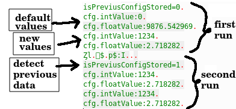

<p align="center">
  <h3 align="center">ConfigDB</h3>

  <p align="center">
    A fast way to store configurations data in the "EEPROM" memory (NodeMCU / esp8266 12e)
  </p>
</p>

<br>

##### Problem
Saving data structures in the EEPROM can be complicated.
This library was created with the purpose of facilitating the saving of configurations in the EEPROM memory

##### Steps to use:
To use this library should jump define your own configuration class (in the example i made MyConfiguration class)

##### Simple example

This code shows examples of saving and obtaining the configuration data.

```c++
#include <math.h>
#include <configdb.h>

/** The custom MyConfiguration class  **/
class MyConfiguration
{
  public:
    int intValue;
    float floatValue;
};

ConfigDB<MyConfiguration> configDB;

bool printCfg(MyConfiguration cfg)
{
    Serial.printf("cfg.intValue:%d\n", cfg.intValue);
    Serial.printf("cfg.floatValue:%f\n", cfg.floatValue);
}

void setup()
{
    Serial.begin(9600);

    //                         intValue | floatValue
    MyConfiguration defaultCfg = {0, 9876.543};

    // If the MyConfiguration is not saved then save it with a default value
    bool isPreviusConfigStored = configDB.storeDefaultIfNotLoad(defaultCfg);

    Serial.printf("\nisPreviusConfigStored=%d\n", isPreviusConfigStored); // False

    // Get the Configuration from the eeprom
    MyConfiguration newCfg = configDB.load();
    printCfg(newCfg);

    // Make new config and save
    newCfg.intValue = 1234;
    newCfg.floatValue = EULER;
    configDB.save(newCfg);

    // Get the new MyConfiguration recently saved in the eeprom
    newCfg = configDB.load();
    printCfg(newCfg);

    configDB.clear();    
}

void loop()
{
    // put your main code here, to run repeatedly:
}
```
<br><br>
This diagram shows a diagram of the hash table used to associate the commands to the functions.


<br><br>
###### Command message format:


